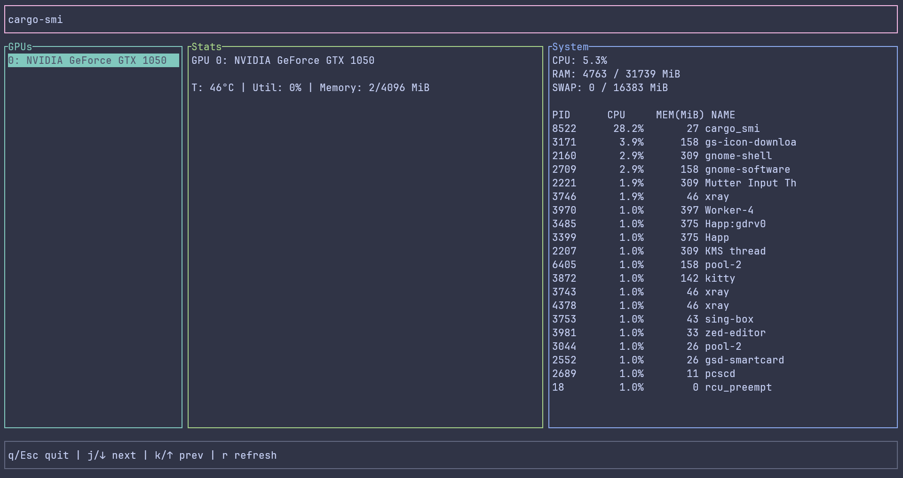

# cargo-smi

<p align="center">
  
</p>

<p align="center">
  <strong>A fast terminal dashboard for NVIDIA GPU and system monitoring.</strong>
</p>
---

`cargo-smi` is a lightweight TUI monitor that shows NVIDIA GPU metrics together with basic system information in one clean terminal dashboard.

Unlike shelling out to `nvidia-smi`, GPU data is collected directly through NVIDIA Management Library using [`nvml-wrapper`](https://docs.rs/nvml-wrapper), which keeps refreshes fast and avoids parsing command output.

## Features

- Direct NVIDIA GPU detection via NVML
- Live GPU stats:
  - temperature
  - utilization
  - memory usage
- Multiple GPU navigation
- System overview:
  - CPU usage
  - RAM usage
  - swap usage
  - top processes by CPU usage
- Keyboard-driven terminal UI
- Configurable refresh interval

## Requirements

- Rust
- NVIDIA GPU
- NVIDIA driver with NVML available

On most Linux systems with the proprietary NVIDIA driver installed, NVML is available as `libnvidia-ml.so`.

## Installation

Clone and build from source:

```bash
git clone https://github.com/haritonn/cargo-smi
cd cargo_smi
cargo build --release
```

Run:

```bash
cargo run --release
```

Run with a custom refresh interval in seconds:

```bash
cargo run --release -- 2
```

## Known limitations

- NVIDIA-only for now
- Requires NVIDIA driver / NVML
- Process list is sorted by CPU usage
- First CPU readings may need one refresh cycle to stabilize
